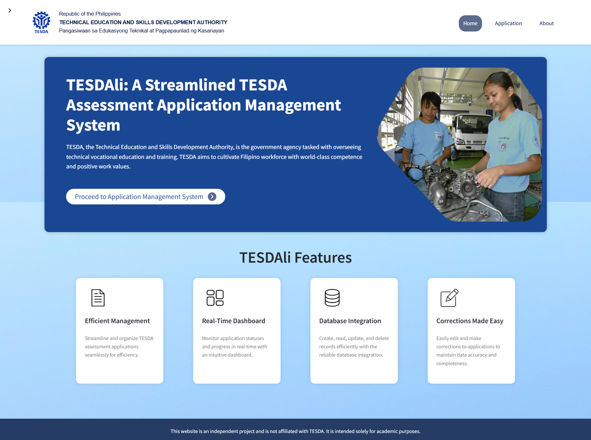
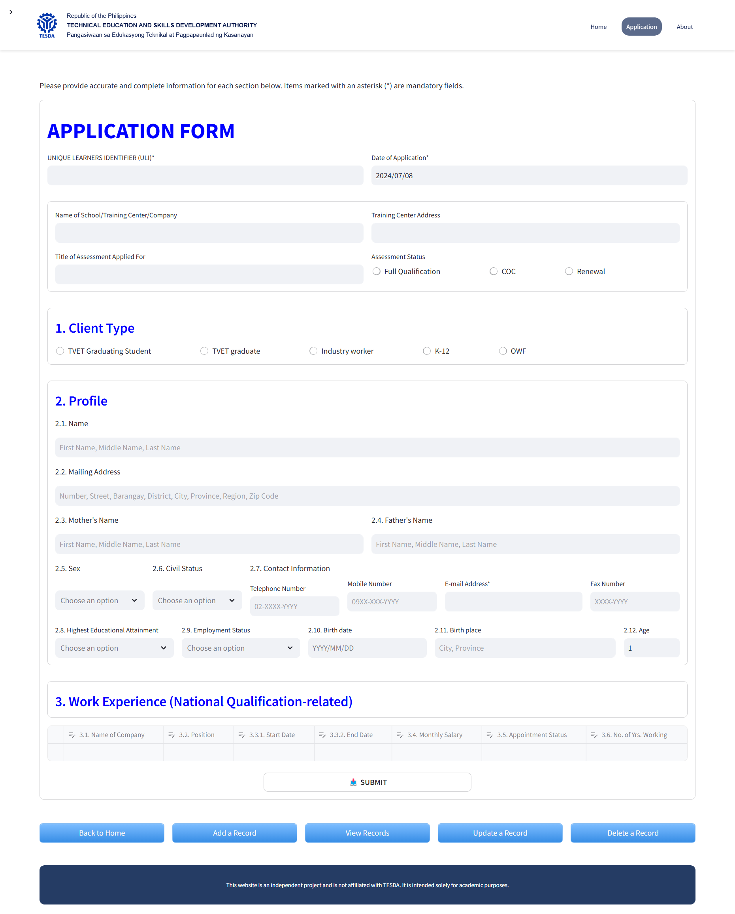
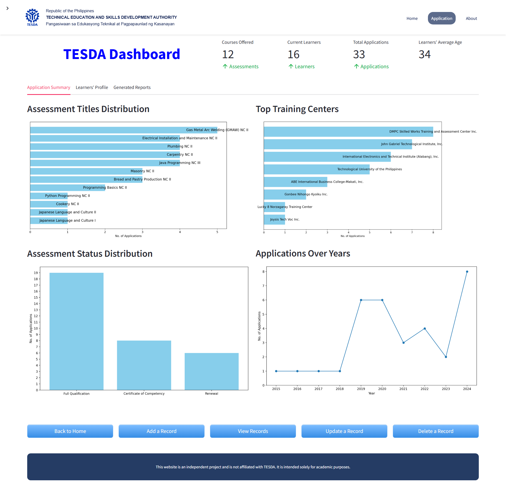

# TESDAli: A Streamlined TESDA Assessment Application Management System [](https://github.com/your-username/tesdali/releases)

TESDAli is a Streamlined TESDA Assessment Application Management System developed to apply the concepts learned in the course COMP 010: Information Management, with a specific focus on database integration. This system enhances the efficiency of handling assessment applications by simplifying the submission, tracking, and management processes, providing a seamless experience for users.

## Table of Contents
1. [Features](#features)
2. [Screenshots](#screenshots)
3. [Tech Stack](#tech-stack)
4. [Installation](#installation)
5. [Usage](#usage)
6. [Database](#database)
7. [Disclaimer](#disclaimer)

## Features
- **Efficient Management**: Streamline and organize TESDA assessment applications seamlessly for improved efficiency.
- **Real-Time Dashboard**: Monitor application statuses and progress in real-time with an intuitive dashboard.
- **Database Integration**: Create, read, update, and delete records efficiently with reliable database integration.

## Screenshots





## Tech Stack
- **Python**: The primary programming language used.
- **Streamlit**: The main framework used to build the web application.
- **MySQL**: Database engine for storing and managing application data.
- **Pandas**: For handling and displaying tabular data.
- **Seaborn**: For data visualization.
- **Plotly**: For interactive plots.

## Installation

1. Clone the repository:
   ```sh
   git clone https://github.com/your-username/tesdali.git
   cd tesdali
   ```
2. Create a virtual environment and activate it:
   ```sh
   python -m venv venv
   source venv/bin/activate  # On Windows use `venv\Scripts\activate`
   ```
3. Install the required packages:
   ```sh
   pip install -r requirements.txt
   ```


## Usage

1. Run the Streamlit application:
   ```sh
   streamlit run app.py
   ```
2. Open your web browser and navigate to http://localhost:8501 to view the application.


## Database

The application uses a MySQL database to store the form data. The database schema includes the following tables:

- **Learners**: Stores personal and contact details of the applicants.
- **Application**: Stores application-specific details.
- **Work_Exp**: Stores work experience related to the national qualifications

Each table's schema is defined in the database_manager.py file.

## Contributors
- **Chynna Mae Doria** - [GitHub](https://github.com/chynnadoria) | [LinkedIn](https://www.linkedin.com/in/chynna-doria)
- **John Lloyd Legaspi** - [GitHub](https://github.com/lloydlegaspi) | [LinkedIn](https://www.linkedin.com/in/john-lloyd-legaspi-80a0b1166)
- **Paul Angelo Macaraeg** - [GitHub](https://github.com/PaullyMac) | [LinkedIn](https://www.linkedin.com/in/paul-macaraeg)
- **Kyla Mae Valoria** - [GitHub](https://github.com/kylavaloria) | [LinkedIn](https://www.linkedin.com/in/kylamaevaloria)

## Disclaimer

The form provided for this project was revised and includes solely the first page of the original document. It does not represent the official form being used by TESDA.
